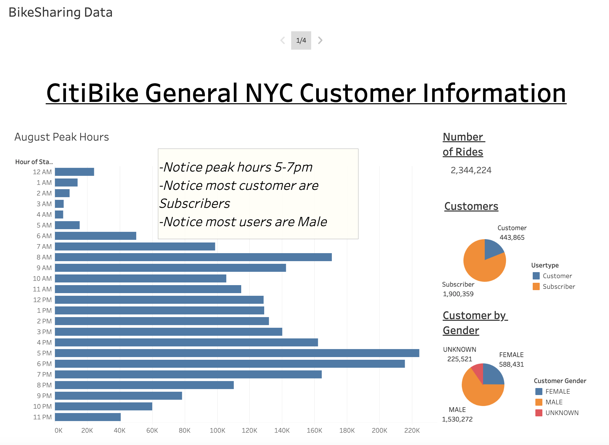
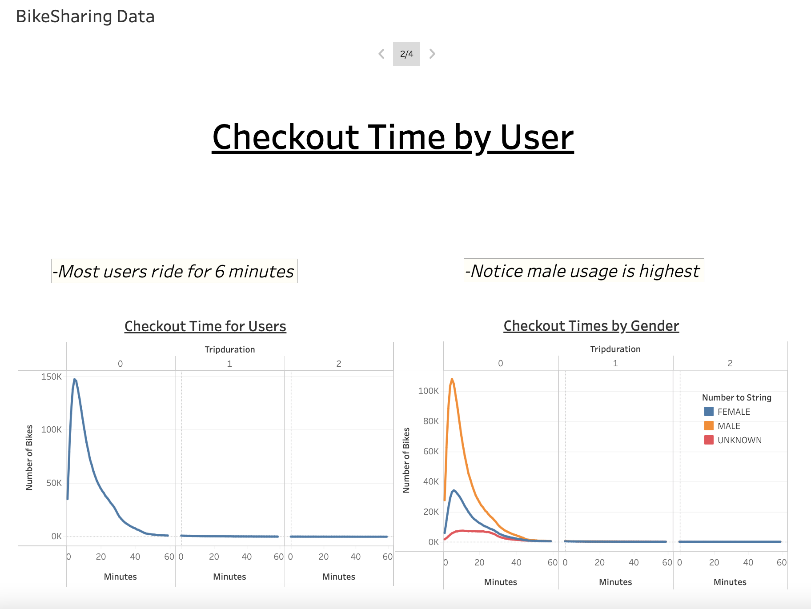
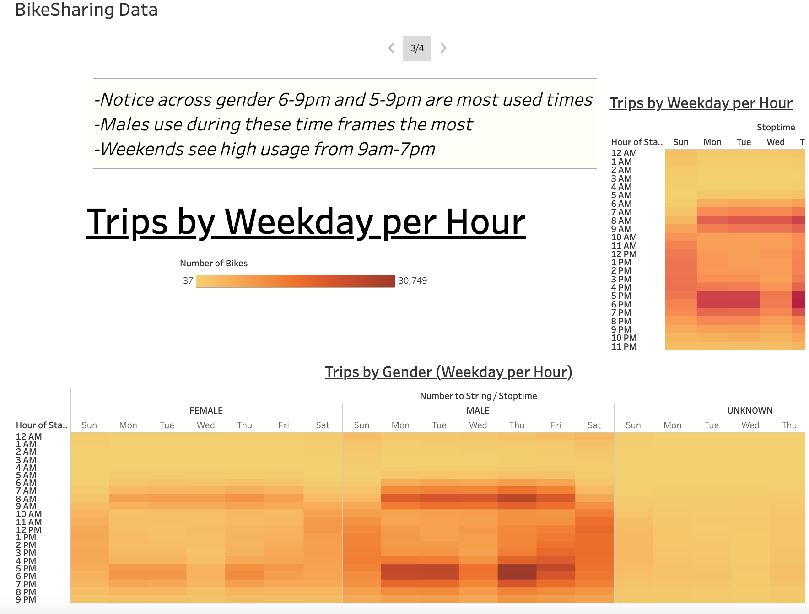
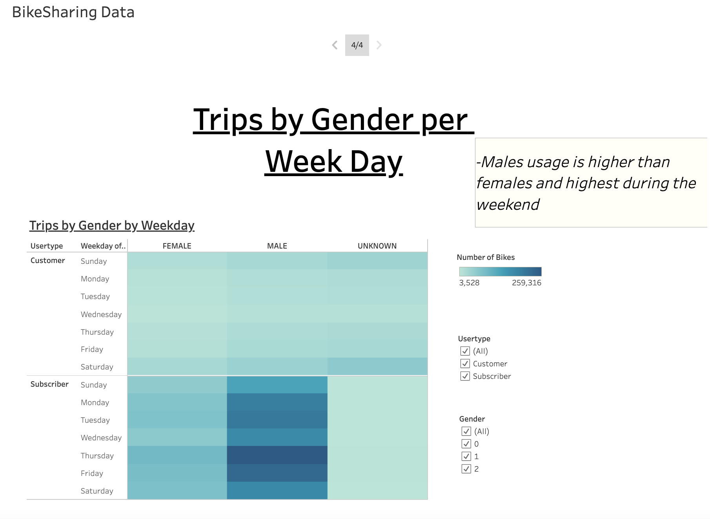

# Bikesharing

# **Purpose**
A client wishes to start a bike share business in Des Moines, Ioha based on the bike sharing company CitiBike which operates in NYC. An angel investor who will provide seed funding wants to see an analysis based on CitiBike data and how it can be applied to operating the business in Des Moines. 

## **Goal**
- Change Trip Duration to a Datetime Format
- Create Visualizations for the Trip Analysis
- Create a Story and Report for the Final Presentation

## **Resources**
- Resources: 201908-citibike-tripdata.csv
- Software: Pandas, Tableau,Jupyter Notebook, Python

## **Results**
The final results can be viewed in story format at:  [link to dashboard](https://public.tableau.com/app/profile/megan.richard8454/viz/CitiBikeProposal_16747812706880/BikeSharingData)

#### Change Trip Duration to a Datetime Format:
The "tripduration" column in the 201908-citibike-tripdata.csv file was changed from an integer to a datetime datatype in the form of hours, minutes, and seconds (00:00:00) using Python and Pandas functions. After it was converted, the data frame was exported as a CSV file to use for goal  2.

#### General Bike Sharing Information:
First general information about bike sharing in New York City was obtained from the CSV. This included total:
- Total Number of Rides: There were 2,344,224 rides in August
- Total Customer: Subscribers vs Customers: Most users are subscribers
- Customers by Gender: Males account for most users
- Peak August Ride Hours by Start Time: The 5-7pm time frame had the most rides

#### Create Visualizations for the Trip Analysis: 
Using Tableau, three visualizations were created that show:
- How long are bikes checked out for all riders and genders? In the image below it shows that most users ride for around 6 minutes before ending their ride. When this information is broken up by genders, it shows most of the 6 minute rides are taken by females. While this trend is seen across male and female users, males take more rides overall in the peak hour time frames. The Unknown gender category does not apply to the trend as usage is similar across all times and days of the week.

- How many trips are taken by the hour for each day of the week, for all riders and genders? The graph below shows that most customers use the bikes in the morning from 6-9pm and in the evening from 5-9pm suggesting that they are commuting to work. Weekends show a different trend. Usage is highest from 9am-7pm. 

- What is the breakdown of what days of the week a user might be more likely to check out a bike, by type of user and gender? This image below shows that Subscribers that are male use the bikes more than other gender specifically during the week. Female subscribers tend to use the bike evenly across the week but least on Wednesdays. The customer usertype as well as the Known gender subscribers usage does not correlate strongly to days of the week as usage is pretty evenly dispersed. 

## Summary
Based on the analysis done to the cvs file in Tableau the following summaries can be made:
- If the CitiBike business model of bike sharing were to be applied in Des Moines, Ioha, investors can expect to see a large number of users meaning many bikes would be needed.
- If it were to offer single use and subscribing services, they could expect to see a majority of users be subscribers and most of the users identifying as male.
- Usage time would be highest during the 8am-10am time frame as well as 5pm-7pm Monday through Friday. During this time frame most of the users would be Male subscribers suggesting they are commuting to work. Female Subscribers also follow this trend but in less numbers. Bikes should be stationed around city offices to support this need. Any operations done to the bikes should be done outside of the peak usage time frames. 
- Regular customers do not have distinct usage patterns.
- Most riders will use the bikes for around 6 minutes.
Additional information is needed to validate the business proposal. Additional visualizations that would be useful are:
1. A graph that shows usage trends by user type and gender throughout the year to confirm the business is profitable year long.
2. Usage trends based on weather and weather trends throughout the year.
3. A graph that further investigates the peak usage hours and the start and stop locations, the typical ride duration, the user type, and the gender. If most users are using the bikes to get to work, this must be taken into consideration when applying this business to Des Moines.
